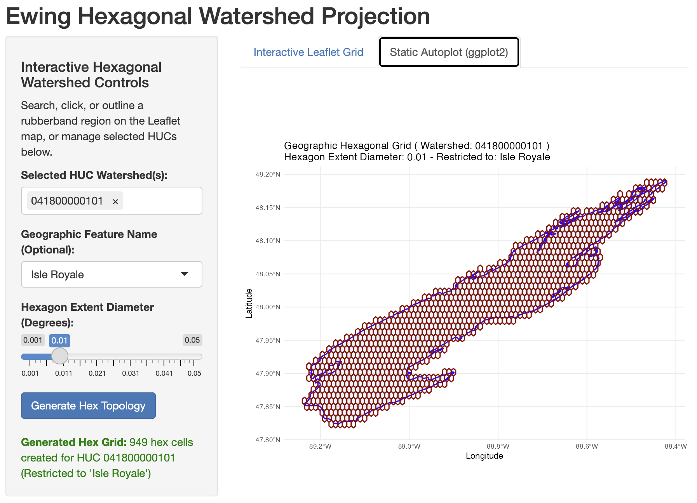

Welcome to the **hexmap** demonstration gallery!

:::: {.grid}

::: {.g-col-12 .g-col-md-6}
::: {.card .h-100}
{.card-img-top style="height: 200px; object-fit: cover;"}

::: {.card-body}
### [hexmapApp (Hexagonal Watershed Explorer)](hexmapApp.qmd){.stretched-link}

Interactive Leaflet discovery of USGS subwatersheds, geographic feature restriction (Isle Royale), and hexagonal substrate grid overlays.
:::
:::
:::

::::

