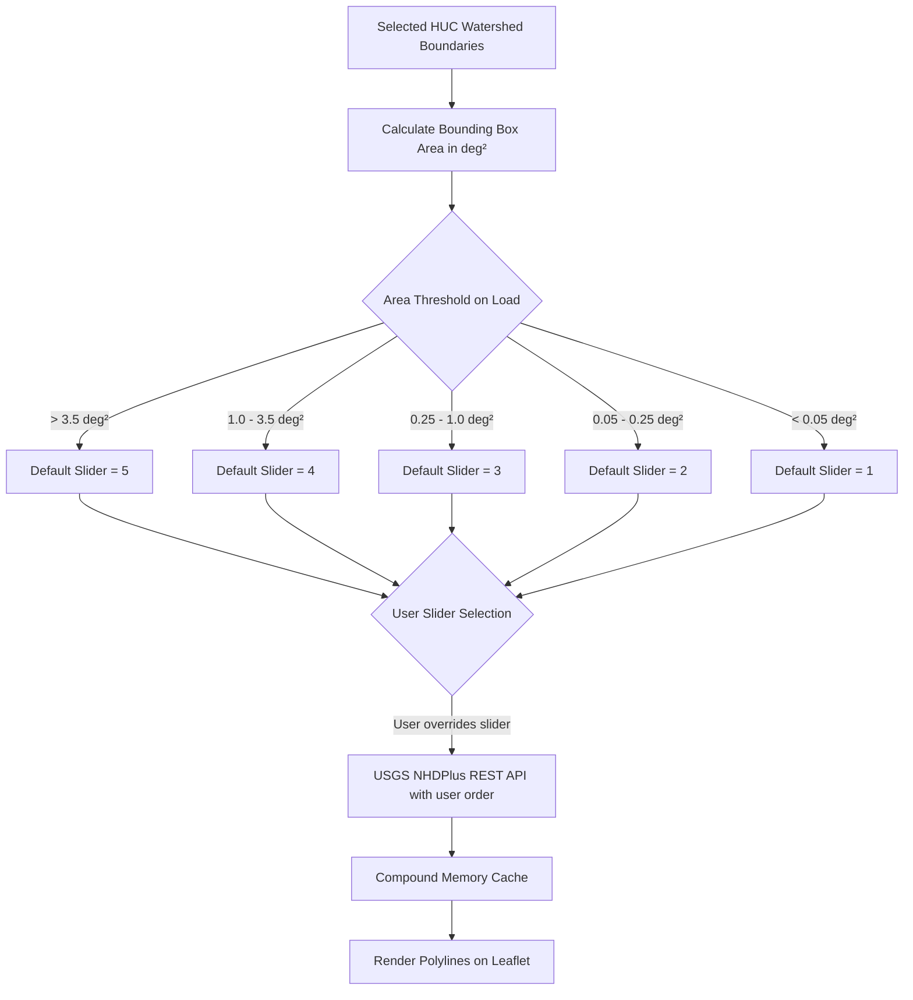
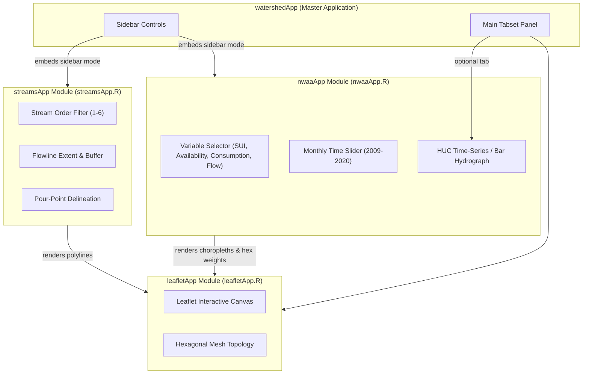

# USGS Integrated Water Availability Assessment (NWAA/CONUS) vs StreamStats: Critique and Integration Plan

## Overview

The [USGS National Water Availability Assessment (NWAA) Data Companion Interactive Map](https://water.usgs.gov/nwaa-data/interactive-map/?basemap=Open+Streets&zoom=4.5&lat=43.866755&lon=-108.608469&sector=integrated-water-availability&model=iwa-assessment-outputs-conus-2025&variable=sui&temporalResolution=monthly&startYear=2020&startMonth=01&addlayers=counties%2Ccropland%2Chuc4%2CnhdNetworkFlowline%2Cnlcd%2Cstates) represents a modern, continental-scale hydrological framework. Built on standardized 12-digit Hydrologic Unit Codes (HUC12) across the Conterminous United States (CONUS), it provides monthly and annual model-derived estimates of water availability, human withdrawals, consumptive use, and supply-use imbalances (such as the Supply-Use Index, `sui`).

This document provides:

1. A comparative critique between **USGS StreamStats** and the **USGS NWAA CONUS 2025** framework.
2. A detailed explanation of how **stream hydrography sourcing**, multi-scale geographic querying, layer visibility orchestration, and the **Min Stream Order** algorithm work across `watershed`.
3. An architectural blueprint for the dedicated **`nwaaApp.R`** module while retaining a focused **`streamsApp.R`** module, showing how both compose cleanly into `watershedApp.R`.

---

## 1. Comparative Critique: StreamStats vs. NWAA CONUS 2025

| Feature / Dimension | USGS StreamStats (`ss-delineate`) | USGS NWAA Data Companion (CONUS 2025) |
| :--- | :--- | :--- |
| **Spatial Scope** | State-by-state implementations (`rcode`, e.g., `"WI"`, `"IL"`, `"NY"`). Multi-state or coastal basins often fail. | Unified, wall-to-wall CONUS coverage (expanding to AK, HI, PR). No state codes required. |
| **Spatial Unit** | Dynamic, arbitrary pour-point raster delineation of custom sub-basins. | Pre-aggregated 12-digit Hydrologic Unit Codes (HUC12), queryable at any HUC scale (HUC2 through HUC12). |
| **Data Products** | Basin boundaries, flow accumulation networks, static basin characteristics, and peak/low flow regression estimates. | Integrated Water Availability Assessment (IWA): Water supply, sector-level use/withdrawals, streamflow, and Supply-Use Index (`sui`). |
| **Temporal Resolution** | Static (time-invariant regression equations and baseline terrain characteristics). | Dynamic time-series: Monthly and annual timesteps from 2000 through present/2025. |
| **API Latency & Reliability** | High latency (10–45s per delineation). Susceptible to server timeouts (HTTP 504), cell snapping failures, and per-state outages. | Fast, sub-second queries via REST web services (`https://api.water.usgs.gov/nwaa-data/data`) and standard WMS/tile overlays. |
| **Integration with `watershed`** | Useful for custom point clicks, but introduces latency bottlenecks and per-state failure modes in interactive Shiny sessions. | Directly aligns with `watershed`'s HUC-based architecture (`nhdplusTools::get_huc()`), polygon workflows, and hexagonal meshes. |

### 1.1 StreamStats Strengths & Limitations

#### Strengths

- **Arbitrary Pour-Point Delineation:** Allows a user to click anywhere on a stream reach and compute the upstream catchment boundary on the fly.
- **Regulatory Peak Flow Equations:** Provides localized USGS regression equations for infrastructure engineering (culvert design, 100-year flood estimates).

#### Limitations

- **Fragility & Fragmentation:** The backend requires specifying a state `rcode` (e.g., `WI`). Points near state boundaries or in unconfigured jurisdictions fail without graceful fallbacks.
- **Latency Bottlenecks:** Real-time GIS raster processing over the web often takes 10 to 45 seconds, degrading the interactive user experience in Shiny applications.
- **Lack of Temporal Hydrologic Dynamics:** Does not provide seasonal or monthly water availability or multi-sector withdrawal stress metrics.

### 1.2 NWAA CONUS 2025 Strengths & Limitations

#### Strengths

- **Standardized CONUS Architecture:** Eliminates `rcode` fragmentation with unified CONUS-wide endpoints.
- **Rich Multi-Sector Modeling:** Exposes water supply, demand, agricultural/industrial use, and water stress metrics (`sui`) across thousands of HUC12 subwatersheds.
- **High-Performance Spatial Querying:** Because HUC12 geometries and model outputs are pre-calculated, queries resolve almost instantaneously.
- **Parent HUC Batch Aggregation:** Querying a parent HUC (e.g., `location=huc6:070900`) returns all child HUC12 records in a single sub-second API request.
- **Seamless Mesh Mapping:** HUC12 boundaries map directly to `watershed`'s hexagonal tessellation and raster spatial projection routines.

#### Limitations

- **Fixed HUC12 Resolution:** Cannot delineate a custom micro-catchment for an arbitrary 100-meter reach unless paired with NHDPlus flowline indexing.
- **Model Output vs. Gauge Observations:** Data represents calibrated model outputs rather than direct real-time stream gauge measurements (though it fills ungauged basin gaps).

---

## 2. Stream Hydrography: Sourcing, Speed & Scale Best Practices

A common point of confusion is whether the package relies on StreamStats to fetch stream lines.

**`watershed` does not use StreamStats to fetch stream networks.**

StreamStats was designed solely for on-the-fly digital elevation raster catchment delineation. Stream flowlines are sourced through high-speed USGS National Hydrography Dataset (NHDPlus) vector services and pre-cached WMS tile layers.

### 2.1 Stream Layer Breakdown & Scale Guidelines

| Stream Layer | Technology / Source | Latency / Mechanism | Recommended Scale |
| :--- | :--- | :--- | :--- |
| **Visual Background Stream Layer** | USGS NWAA / The National Map WMS (`add_nwaa_flowlines_layer()`, `add_usgs_hydro_layer()`) | **Instant (0.05s):** Pre-rendered map tiles served directly from USGS ArcGIS MapServers (`hydro.nationalmap.gov`). Zero R geometry calculation. | **Macro Basins (HUC2, HUC4, HUC6, multi-state regions).** |
| **Vector Stream Flowlines (`sf` Linestrings)** | USGS NHDPlus v2 via `nhdplusTools::get_nhdplus()` (`get_watershed_flowlines()`) | **Sub-second for local HUCs; 30–60s for 9+ HUC6s:** Queries live USGS REST services, filtered by Strahler stream order (1–6), and cached in-memory. | **Local Subwatersheds (HUC10, HUC12) or major rivers (Order 5–6).** |
| **Custom Pour-Point Delineation** | USGS StreamStats (`add_streamstats_layer()`) | **Slow (10–30s):** Computes raster flow accumulation grids on demand for an arbitrary stream click. | **Point-and-click reach analysis.** |
| **Fast Watershed Delineation Alternative** | USGS Network Linked Data Index (NLDI) via `nhdplusTools::get_nldi_basin()` | **Sub-second:** Uses pre-indexed flowline COMIDs across CONUS to trace upstream basins instantly without raster processing. | **Instant continental catchment tracing.** |

### 2.2 Why Multi-HUC6 Regions Take Time for Vector Flowlines

A single HUC6 basin spans approximately 25,000–50,000 $\text{km}^2$. Selecting **9 HUC6 basins** covers over **300,000 $\text{km}^2$** (spanning several full US states).

When clicking *"Constrained to HUC(s)"* on such a macro-scale:
- The USGS NHDPlus server must query, serialize, and transmit **over 20,000 vector linestring segments**.
- Benchmarking shows Order 5 stream reaches alone take **~40 seconds** over the public web API.
- For broad multi-state exploration, the **USGS Hydrography WMS tile overlay** provides immediate visual inspection, while vector flowlines are optimized for local subwatershed modeling.

### 2.3 Layer Visibility Orchestration (WMS vs. Vector Streams)

To prevent visual confusion when exploring constrained flowlines:
- **Automatic WMS Suppression:** When any vector flowline extent mode is active (`"Constrained to HUC(s)"`, `"Extended Bounding Box"`, or `"Buffered HUC Region"`), the unconstrained background tile layer (`"USGS Hydrography (Streams)"`) is automatically hidden via `leaflet::hideGroup()`. This ensures that only the vector flowlines strictly belonging to the active basin are shown.
- **Automatic WMS Restoration:** When the user switches stream extent back to `"None"`, the full-screen visual hydrography WMS layer is restored via `leaflet::showGroup()`.

---

## 3. How "Min Stream Order" Works

Strahler Stream Order categorizes rivers and tributaries by size and hierarchy:

- **Order 1:** Headwater streams with no upstream tributaries.
- **Order 2–3:** Intermediate creeks and small rivers formed by the confluence of headwater streams.
- **Order 4–6+:** Major trunk rivers (e.g., Wisconsin River, Mississippi River).

Fetching all Order 1 headwaters across a large regional basin (such as HUC4 or HUC6) can yield hundreds of thousands of vertices, causing network timeouts and freezing the browser's Leaflet renderer. `watershed` solves this through an **adaptive filtering and priority system**.



### 3.1 Dynamic Area-Weighted Scaling (`get_watershed_flowlines()`)

In `R/watershed.R`, when `get_watershed_flowlines()` is called:

1. The total geographic bounding box area $A_{\text{deg}^2} = \Delta x \times \Delta y$ of all selected HUCs is computed.
2. A smart default order `area_min_order` is calculated for initial loading:
   - $A > 3.5 \text{ deg}^2 \implies$ Default Order **5**
   - $A > 1.0 \text{ deg}^2 \implies$ Default Order **4**
   - $A > 0.25 \text{ deg}^2 \implies$ Default Order **3**
   - $A > 0.05 \text{ deg}^2 \implies$ Default Order **2**
   - Otherwise $\implies$ Default Order **1**
3. The effective query order directly honors the user's manual selection:
   $$\text{effective\_min\_order} = \begin{cases} \text{as.integer}(\text{min\_stream\_order}), & \text{if specified by user} \\ \text{area\_min\_order}, & \text{if NULL / default} \end{cases}$$
4. This parameter is sent directly to `nhdplusTools::get_nhdplus(AOI = ..., streamorder = effective_min_order)` so adjusting the slider (e.g. from 6 to 2) dynamically fetches and renders the finer tributary network.

### 3.2 Dynamic Slider Synchronization in Shiny (`streamsApp.R`)

In `R/streamsApp.R`, `streamsServer()` sets an intelligent initial default for the slider when a new watershed region is loaded:

- When loading a macro basin (e.g., HUC6 with $A > 1.0 \text{ deg}^2$), the slider initializes to order **4** or **5** to prevent initial browser lag.
- The user can then freely slide down to **2** or **1** to load and explore finer tributary networks.
- A progress bar (`shiny::withProgress`) informs the user while live NHD flowlines are retrieved from the federal server.

### 3.3 Compound Key In-Memory Caching

To prevent redundant network requests when toggling between layers or adjusting visualization options, flowlines are cached under compound keys:
$$\text{Key} = \texttt{"huc\_<ID>\_ext\_<ext>\_buf\_<buf>\_ord\_<ord>"}$$
When multiple HUCs are selected, the package checks which HUCs are already cached in memory and issues a single unified batch query only for the missing HUCs.

---

## 4. Modular Shiny Design: Why `nwaaApp.R` and `streamsApp.R` Coexist

**Recommendation:** Maintain a dedicated **`nwaaApp.R`** module while **retaining and focusing `streamsApp.R`**.



### 4.1 Functional Specialization

1. **`streamsApp.R` (Stream Network & Micro-Catchments):**
   - Manages linear stream geometry: NHD flowline rendering, stream order filtering (Strahler 1–6), flowline extent bounding (constrained to HUC, bounding box, or buffer), and on-demand pour-point delineation.
2. **`nwaaApp.R` (National Water Availability & Time-Series Assessment):**
   - Manages areal water balance: HUC choropleths, monthly/annual time-series sliders (2009–2020), multi-sector water demand, and the Supply-Use Index (`sui`).

---

## 5. Package Implementation Architecture

### 5.1 R Module Matrix

| Module File | Exported UI / Server Functions | Primary Role |
| :--- | :--- | :--- |
| `R/streams.R` | `add_streamstats_layer()`, `add_usgs_hydro_layer()`, `add_usgs_shaded_relief_layer()`, `add_usgs_topo_layer()` | Low-level Leaflet layer bindings for USGS hydrography tiles and StreamStats GeoJSON. |
| `R/streamsApp.R` | `streamsInput()`, `streamsServer()`, `streamsApp()` | Hydrography flowline controls, stream order sliders, and interactive pour-point catchment delineation. |
| `R/nwaa.R` | `get_nwaa_data()`, `get_nwaa_models()`, `get_nwaa_variables()`, `add_nwaa_flowlines_layer()`, `add_nwaa_huc_overlay()` | Low-level REST API client for USGS NWAA Data Companion and WMS/vector tile builders. |
| `R/nwaaApp.R` | `nwaaInput()`, `nwaaOutput()`, `nwaaServer()`, `nwaaApp()` | Interactive NWAA explorer: variable selector, monthly date slider, HUC choropleths, and time-series plots. |
| `R/watershedApp.R` | `watershedInput()`, `watershedOutput()`, `watershedServer()`, `watershedApp()` | Master application composing `leafletServer`, `streamsServer`, and `nwaaServer` with hexagonal topology projection. |

---

## 6. OpenAPI REST Client Implementation Details

### 6.1 USGS NWAA REST Client (`R/nwaa.R`)

The official USGS NWAA Data Companion OpenAPI endpoint (`https://api.water.usgs.gov/nwaa-data/data`) requires prefixed location parameters:

```r
#' Fetch USGS NWAA Integrated Water Availability Assessment Data
#'
#' @param huc Character vector of HUC identifiers (e.g., "070900020603" or "070900").
#' @param model Model identifier (default: "iwa-assessment-outputs-conus-2025").
#' @param variable Variable identifier ("sui", "availab", "consum", "strflow").
#' @param start_year Numeric assessment year (default: 2020).
#' @param start_month Numeric assessment month (default: 1).
#'
#' @return A data frame containing HUC child records and metric values.
#' @export
get_nwaa_data <- function(huc,
                          model = "iwa-assessment-outputs-conus-2025",
                          variable = "sui",
                          start_year = 2020,
                          start_month = 1,
                          end_year = NULL,
                          end_month = NULL) {
  if (missing(huc) || length(huc) == 0) return(data.frame())

  start_dt <- sprintf("%04d-%02d", as.numeric(start_year), as.numeric(start_month))
  end_yr <- if (!is.null(end_year)) end_year else start_year
  end_mo <- if (!is.null(end_month)) end_month else start_month
  end_dt <- sprintf("%04d-%02d", as.numeric(end_yr), as.numeric(end_mo))

  huc_clean <- unique(trimws(as.character(huc)))
  huc_clean <- huc_clean[nzchar(huc_clean)]
  if (length(huc_clean) == 0) return(data.frame())

  res_list <- lapply(huc_clean, function(hid) {
    n_digits <- nchar(hid)
    loc_param <- sprintf("huc%d:%s", n_digits, hid)

    req <- httr2::request("https://api.water.usgs.gov/nwaa-data/data") |>
      httr2::req_url_query(
        model = model,
        variable = variable,
        location = loc_param,
        startdate = start_dt,
        enddate = end_dt,
        timeres = "monthly",
        format = "json"
      ) |>
      httr2::req_headers(Accept = "application/json") |>
      httr2::req_timeout(20)

    resp <- tryCatch(httr2::req_perform(req), error = function(e) NULL)
    if (is.null(resp) || httr2::resp_status(resp) != 200) return(NULL)

    json_raw <- tryCatch(httr2::resp_body_json(resp, simplifyVector = FALSE), error = function(e) NULL)
    if (is.null(json_raw) || is.null(json_raw$data) || is.null(json_raw$data$huc12_id)) return(NULL)

    h_list <- json_raw$data$huc12_id
    rows <- lapply(names(h_list), function(child_id) {
      recs <- h_list[[child_id]]
      if (length(recs) > 0 && is.list(recs[[1]])) {
        rec <- recs[[1]]
        val <- if (!is.null(rec[[variable]])) rec[[variable]] else NA_real_
        ym <- if (!is.null(rec[["year_month"]])) rec[["year_month"]] else start_dt
        data.frame(
          huc12 = child_id,
          parent_huc = hid,
          value = as.numeric(val),
          year_month = ym,
          variable = variable,
          stringsAsFactors = FALSE
        )
      } else {
        NULL
      }
    })
    do.call(rbind, rows)
  })

  out <- do.call(rbind, res_list)
  if (is.null(out)) data.frame() else out
}
```

---

## 7. Hexagonal Mesh Integration

One of the signature capabilities of `watershed` is projecting spatial hydrology data onto regular hexagonal meshes (`add_watershed_hex_overlay()`).

By integrating NWAA CONUS data:

1. The user selects a region of interest or HUC8/HUC10 basin.
2. The package queries all child HUC12 NWAA water availability metrics across the selected time period.
3. The values are spatially intersected and area-weighted onto the hexagonal grid substrate:
   $$\bar{V}_{\text{hex}} = \frac{\sum_{i} A_i \cdot V_{\text{HUC12}, i}}{\sum_i A_i}$$
   where $A_i$ is the intersection area between the hexagonal cell and HUC12 polygon $i$, and $V_{\text{HUC12}, i}$ is the NWAA variable value (e.g. `sui`).

This provides seamless, continuous visualization of regional water stress and availability across standardized hexagonal map representations.
